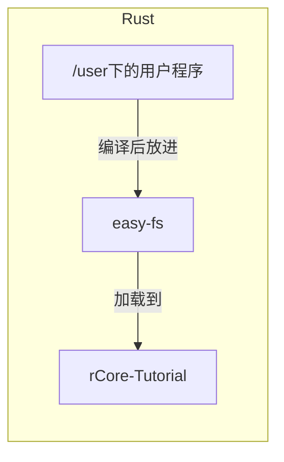
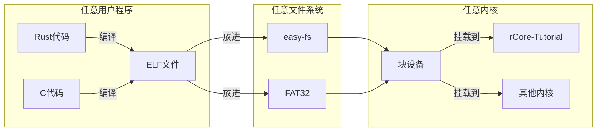

# 运行裸机 C 程序

建议至少做完 rCore-Tutorial ch6 再做这个实验。

## 实验准备

你需要下载用于交叉编译的工具链：`https://musl.cc/riscv64-linux-musl-cross.tgz`，解压后将里面的 `bin` 目录放到你的 `PATH` 中，然后尝试使用以下命令

```
riscv64-linux-musl-gcc --version
```

来检查是否安装成功。

> 如果忘了怎么安装这类包，可以看`rCore-Tutorial` 指导书第0章环境配置中安装 Qemu 模拟器一节，操作是类似的。

## 实验概述

在往年的实验中，有些同学会有这样一种感受：整个 rCore-Tutorial 是一个完整的项目，从内核到测例到文件系统都是用 Rust 连接的，修改任何一部分都需要做额外的兼容。就像下面这样：



但其实这中间都是二进制接口，只是被实验仓库里完善的脚本掩盖了。我们可以任意更换这其中的每个部分，而不需要做另外的适配：



在本章中，我们将回顾用户程序的编译与加载流程，然后使用一个极简的 C 用户程序库代替 rCore-Tutorial 原有的 `/user` 测例，并修改上面这套编译、打包、加载的流程中的各个 Makefile，让我们的内核运行一个 C 语言的 `helloworld`。
