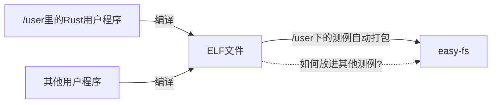

## 打包进文件系统

现在我们已经可以统一 Rust 和 C 的测例了，但现在的 rCore-Tutorial 只支持自动编译 并打包`/user` 下的测例，怎么把其他测例也放进 `easy-fs` 呢？



在 `ch6` 中，我们知道 `easy-fs-fuse` 模块负责将用户程序打包成满足 `easy-fs` 格式的文件系统镜像。既然上面已经分析出 C 的应用和 Rust 的应用赛道文件系统镜像里没什么两样，现在我们就可以扩展这个模块，使得它可以生成同时包含 Rust 和 C 用户程序的镜像。（**下面的说明只是其中一种做法，你可以用自己的方式完成这一步！**）

> 其实，如果想要让内核支持 C 应用程序，可以一步到位，直接撇开原本的 `user` 库，只编译 C 的程序（比赛初赛的测例就完全没有 Rust 的用户程序）。
> 
> 但由于本来的 rCore-Tutorial 实验已经包含了带 `initproc` 和 `user_shell` 的 Rust 用户程序，直接抛弃这些支持就会让调试过程重回 `ch3/ch4` 的状态，并且也难以利用已通过的大量 rCore 测例检查有没有改错东西，这对基础弱的同学不太友好。
> 
> 因此，我们选择了折衷的方式进行讲解，让本实验中的内核可同时接收 C 和 Rust 的用户程序。

首先，我们来找找 `easy-fs-fuse` 是什么时候被调用的。

当在 `os` 文件夹下运行 `make run`时，文件系统镜像会自动生成。观察 `os/Makefile`文件，可以发现 `run` 命令依赖于 `build`，`build` 命令依赖于 `fs-img`，这就是我们要找的命令了。

```makefile
fs-img: $(APPS)
    @make -C ../user build TEST=$(TEST) CHAPTER=$(CHAPTER) BASE=$(BASE)
    @rm -f $(FS_IMG)
    @cd ../easy-fs-fuse && cargo run --release -- -s ../user/src/bin/ -t ../user/target/riscv64gc-unknown-none-elf/release/
```

回顾 `ch6`，最后这条命令的逻辑是，从 `-s` 后的目录 `../user/src/bin` 中获取所有测例的名字，然后在 `-t` 后的目录 `../user/target/riscv64gc-unknown-none-elf/release/` 中依次找到对应的 ELF 文件，加入到文件系统镜像中。文件系统镜像最终会被放在 `-t` 后的目录（见 `os/Makefile` 开头 `FS_IMG` 的定义）。

这个 `-s` 有点啰嗦，我们只需要知道什么文件应该被打包，不需要知道它们的源文件是什么，况且之后要支持的 C 用户程序是不会有 Rust 的源文件的。由此可以修改一下这里 `-s` 和 `-t` 的语义：

- `-s` 之后的目录定义为要打包塞进文件系统镜像中的目录。 `easy-fs-fuse` 会依次寻找目录中的文件塞进文件系统镜像里。
- `-t`之后的目录仅用来存放最终生成的文件系统镜像。

然后把命令重写成：

```makefile
FS_IMG := target/fs.img
......

fs-img: $(APPS)
    @make -C ../user build TEST=$(TEST) CHAPTER=$(CHAPTER) BASE=$(BASE)
    @rm -f $(FS_IMG)
    @cd ../easy-fs-fuse && cargo run --release -- -s ../user/build/elf/ -t ../os/target/
```

其中 `FS_IMG` 是 `os/Makefile` 开头定义的变量。按照新的语义，此时 `fs-img` 命令的逻辑就变成了“将 `../user/build/elf`” 中的所有文件打包成文件系统镜像，放在 `../os/target/` 里。当然，还需要修改 `easy-fs-fuse` 使之满足新的语义：

```rust
// easy-fs-fuse/src/main.rs

let root_inode = Arc::new(EasyFileSystem::root_inode(&efs));

/*
let apps: Vec<_> = read_dir(src_path)
    .unwrap()
    .into_iter()
    .map(|dir_entry| {
        let mut name_with_ext = dir_entry.unwrap().file_name().into_string().unwrap();
        name_with_ext.drain(name_with_ext.find('.').unwrap()..name_with_ext.len());
        name_with_ext
    })
    .collect();
for app in apps {
    // load app data from host file system
    let mut host_file = File::open(format!("{}{}", target_path, app)).unwrap();
    let mut all_data: Vec<u8> = Vec::new();
    host_file.read_to_end(&mut all_data).unwrap();
    // create a file in easy-fs
    let inode = root_inode.create(app.as_str()).unwrap();
    // write data to easy-fs
    inode.write_at(0, all_data.as_slice());
}
*/

for dir_entry in read_dir(src_path).unwrap().into_iter() {
    let dir_entry = dir_entry.unwrap();
    let path = dir_entry.path();
    let file_name = dir_entry.file_name().into_string().unwrap();
    let base_name = &file_name[..file_name.rfind('.').unwrap_or(file_name.len())];
    let mut host_file = File::open(&path).unwrap();
    let mut all_data: Vec<u8> = Vec::new();
    host_file.read_to_end(&mut all_data).unwrap();
    // create a file in easy-fs
    let inode = root_inode.create(base_name).unwrap();
    // write data to easy-fs
    inode.write_at(0, all_data.as_slice());
}
```

对比原本的代码（上面的注释）和修改后的新代码：

- `src_path` 目录原本被用来寻找所有源代码文件的名字，生成 `apps` 后再从 `target_path`中找对应的文件；修改后，代码通过 `read_dir(src_path).unwrap().into_iter()` 直接从 `src_path` 中去寻找文件塞进文件系统镜像里。

- 原本的代码中，通过 `name_with_ext.find('.').unwrap()` 找到每一个文件的后缀名，然后通过 `name_with_ext.drain` 删除，如果文件名中不包含 `.`，整个 `easy-fs-fuse` 就会报错。现在的代码通过 `file_name.rfind('.')`  寻找最后一个后缀名并删除，如果文件名中不包含 `.`，则会取文件全名。
  
  > 当然，在现在的实现中，如果出现两个文件仅有后缀名不同的情况，会导致出错，不过这种检查也很容易实现。
  > 
  > 可不可以不去除后缀名，直接原封不动把文件放到镜像里？
  > 
  > 可以，但比较麻烦。我们之所以一定要执着地去除后缀名，是因为可执行程序一般默认是无后缀的。如内核启动时首先会去找 `initproc`，这个用户程序又会去找 `user_shell`，而每一章的 `usertest` 也会去找每一个对应章节的测例。如果所有这些地方都考虑后缀，代码改起来就会很麻烦。不过，过渡到只是用 C 语言用户程序的初赛时，可以考虑把去后缀这一步删掉。

还可以把这段修改下面的几行代码

```rust
    for app in root_inode.ls() {
         println!("{}", app);
    }
```

前的注释删掉以便观察最终被打包的文件有哪些。现在我们回到 `os` 目录，执行 `fs-img CHAPTER=8 BASE=2` 可以看到我们修改过的 `easy-fs-fuse` 正确打包了文件。

#### 如何将 C 语言测例也包括进来呢？

别忘了 C 的用户程序在 `testcases`里。我们像 `user` 那样也调用一次 `make build` 生成可执行文件，然后把两拨测例复制到一起，再交给 `easy-fs-fuse` 打包就可以了。现在我们再次修改 `os/Makefile` 中的 `fs-img` 命令如下

```makefile
fs-img: $(APPS)
    @make -C ../user build TEST=$(TEST) CHAPTER=$(CHAPTER) BASE=$(BASE)
    @make -C ../testcases build
    @rm -f $(FS_IMG)
    @cp ../user/build/elf/* ../testcases/build/
    @cd ../easy-fs-fuse && cargo run --release -- -s ../testcases/build/ -t ../os/target/
```

现在我们可以同时打包 Rust 和 C 的用户程序了！

再次在`os` 目录执行 `fs-img CHAPTER=8 BASE=2`，就可以唤出 `usershell` 了，现在你可以尝试运行本实验所使用的两个 C 语言用户程序了。
