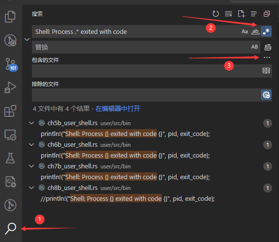

# 寻找报错位置

在这一小节中，我们会尝试分析 `hellostd` 测例的报错情况，并介绍三种常见的内核调试技巧。巧合的是，我们的调试过程恰好会用到每一项技巧，因此你可以跟着指导书走一遍整个流程以熟悉它们，而不只是枯燥地听课看文档。

## 调试技巧：全局搜索输出

按照上一节的实验准备下载好测例后，我们来尝试在目前的内核中运行 `hellostd` 这个测例。在 `os/` 目录下 `make run`，然后在弹出的终端中输入 `hellostd`，大概率会得到下面这样一行错误输出：

```bash
Rust user shell
>> hellostd
Shell: Process 2 exited with code -11
```

> 如果运行结果是 `exited with code -4` 而不是 `-11`，说明你在上一个实验中的实现碰巧“跳过”了这一个 bug。此时可以阅览一下本节的内容，然后下一节再跟着做

显然，这个测例运行失败了，但是是在哪里失败的呢？我们可以尝试全局搜索一下这一行是在哪里输出的。首先，`2` 和 `-11` 看上去不像是直接写在代码里的内容，我们要找的应该是 `Shell: Process ` 和 ` exited with code` 这两段文本，且它们中间隔着一些其他字符。所以可以把要搜索的表达式写成 `Shell: Process .* exited with code`

> 注意，不要想当然认为中间要搜的部分是 `[0-9]` 的数字。它们应该是任意匹配的字符。
> 
> 因为要搜索的是“代码”而不是同样格式的“输出”，所以很可能我们要找的内容类似下面几种形式之一：
> ```
> println!("Shell: Process {} exited with code {}", id, code);
> println!("Shell: Process {id} exited with code {code}");
> printf("Shell: Process %d exited with code %d", id, code);
> ```
> 它们中间对应 `2` 和 `-11` 的部分都不是数字。

然后我们就可以使用如下命令搜索可能的输出位置。

```bash
grep -rn "Shell: Process .* exited with code" ./src
```

其中，`-r` 表示递归搜索下面的目录，`-n` 表示找到字符串时输出对应行号。而 `./src` 是我们要搜索的目录，因为现在在 `os/` 下，所以实际搜索的是 `os/src/` 下的内容，也就是内核的代码。

不出意外的话，上面这条命令不会给出任何输出，这说明内核代码里没有这样的语句。不过，这一行也可能是用户程序输出的，我们在用户测例的代码目录再试一次：

```bash
grep -rn "Shell: Process .* exited with code" ../user/src
```

这次我们找到了输出的具体位置，是其中一个 user_shell，即终端程序。具体是哪一个取决于你正在运行本实验的分支。

```bash
../user/src/bin/ch8b_user_shell.rs:193:                            //println!("Shell: Process {} exited with code {}", pid, exit_code);
../user/src/bin/ch7b_user_shell.rs:107:                        println!("Shell: Process {} exited with code {}", pid, exit_code);
../user/src/bin/ch6b_user_shell.rs:43:                        println!("Shell: Process {} exited with code {}", pid, exit_code);
../user/src/bin/ch5b_user_shell.rs:43:                        println!("Shell: Process {} exited with code {}", pid, exit_code);
```

### VSCODE 的全局搜索

如果你在使用带 GUI 的 IDE 编程，也可以完全不用记上面的命令。例如 VSCODE 就带有一个搜索器。



以 VSCODE 为例，简单介绍一下这个工具的用法：

- 如图所示，你可以在窗口左侧找到搜索功能（标点`1`），然后在第一个框内输入要搜索的字符串。
- 如果字符串中包含正则匹配相关的内容，可以打开右侧的正则表达式开关（标点`2`）。顺便一提，前两个开关分别是区分大小写和全词匹配（即不允许匹配半个词，两边必须是空格或符号）
- 这个搜索的范围默认是这个窗口打开的目录。如果想在指定目录下搜索，或者去除某些目录的搜索结果，可以点开右下角的按钮（标点`3`），然后输出搜索目录。

你可以直接点击搜索结果跳转到对应的文件，不需要手动翻找目录去打开文件。

## 调试技巧：别忘了 LOG 输出

找到了输出位置，我们来看看 `user_shell` 为什么会告诉我们 `Shell: Process 2 exited with code -11`。先阅览一下 `ch7b_user_shell.rs` 在这条输出附近的代码：

```rust
if pid == 0 {
    // input redirection
    if !input.is_empty() {
        let input_fd = open(input.as_str(), OpenFlags::RDONLY);
        if input_fd == -1 {
            println!("Error when opening file {}", input);
            return -4;
        }
        let input_fd = input_fd as usize;
        close(0);
        assert_eq!(dup(input_fd), 0);
        close(input_fd);
    }
    // output redirection
    if !output.is_empty() {
        let output_fd =
            open(output.as_str(), OpenFlags::CREATE | OpenFlags::WRONLY);
        if output_fd == -1 {
            println!("Error when opening file {}", output);
            return -4;
        }
        let output_fd = output_fd as usize;
        close(1);
        assert_eq!(dup(output_fd), 1);
        close(output_fd);
    }
    // child process
    if exec(args_copy[0].as_str(), args_addr.as_slice()) == -1 {
        println!("Error when executing!");
        return -4;
    }
    unreachable!();
} else {
    let mut exit_code: i32 = 0;
    let exit_pid = waitpid(pid as usize, &mut exit_code);
    assert_eq!(pid, exit_pid);
    println!("Shell: Process {} exited with code {}", pid, exit_code);
}
```

可以看到，这个程序执行失败并不是因为打开文件失败或者 `exec` 函数失败，而是 `user_shell` 在 `waitpid` 等待它执行完成的时候，得知了程序返回 `-11` 的消息。这说明它很可能已经正常进入用户态了，是运行途中出现的问题。

那么，`-11` 是哪来的呢？如果是用户程序自己 `exit` 时传入的参数 `-11`，那么我们可能得另找办法了。不过幸运的是，我们直接在内核代码中搜索 `-11` 就能找到它的来源：

```bash
grep -rn "\-11" ./src
./src/task/context.rs:11:    /// s0-11 register, callee saved
./src/task/signal.rs:33:            Some((-11, "Segmentation Fault, SIGSEGV=11"))
```

> 如果不加反斜杠 `\`，`grep` 会把 `-` 理解成正则表达式里的负号。而加了反斜杠以后， `\-` 才表示我们真的想搜索这个负号。你可以试一试去掉反斜杠 `\` 会搜出什么结果。
> 
> 所以有搜索 GUI 的情况下还是用 GUI 比较方便。

来自 `signal.rs` 的代码告诉我们，`-11` 可能来自一个段错误，继续搜索 `SIGSEGV` 就能找到触发的位置：
```rust
/// at os/src/trap/mod.rs
#[no_mangle]
pub fn trap_handler() -> ! {
    set_kernel_trap_entry();
    let scause = scause::read();
    let stval = stval::read();
    // trace!("into {:?}", scause.cause());
    match scause.cause() {
        Trap::Exception(Exception::UserEnvCall) => {
            // jump to next instruction anyway
            let mut cx = current_trap_cx();
            cx.sepc += 4;
            // get system call return value
            let result = syscall(cx.x[17], [cx.x[10], cx.x[11], cx.x[12], cx.x[13]]);
            // cx is changed during sys_exec, so we have to call it again
            cx = current_trap_cx();
            cx.x[10] = result as usize;
        }
        Trap::Exception(Exception::StoreFault)
        | Trap::Exception(Exception::StorePageFault)
        | Trap::Exception(Exception::InstructionFault)
        | Trap::Exception(Exception::InstructionPageFault)
        | Trap::Exception(Exception::LoadFault)
        | Trap::Exception(Exception::LoadPageFault) => {
            error!(
                "[kernel] trap_handler: {:?} in application, bad addr = {:#x}, bad instruction = {:#x}, kernel killed it.",
                scause.cause(),
                stval,
                current_trap_cx().sepc,
            );
            current_add_signal(SignalFlags::SIGSEGV);
        }
```

这个测例是不是触发了 `Exception::LoadPageFault`？注意到 `SISEGV` 前有 `error` 输出，我们只需要使用 `make run LOG=ERROR` 就可以看到所有 `ERROR` 级别以上的内核输出了。其实在 `rCore-Tutorial ch3` 的问答作业中就提到过 `LOG` 功能的用法，甚至于在 `ch1` 和 `ch2` 中还尝试了使用 `log` 输出五颜六色的调试语句，不过可能大部分同学已经忘了还有这一层调试工具。

现在我们在 `os/` 目录下执行 `make run LOG=ERROR`，然后在弹出的终端中输入 `hellostd`，你会得到如下所示的输出

```bash
>> hellostd
[ERROR] [kernel] trap_handler: Exception(LoadPageFault) in application, bad addr = 0xb000, bad instruction = 0x572, kernel killed it.
Shell: Process 2 exited with code -11
```

虽然报错的地址可能略有不同（取决于你在上一个实验中的代码实现），但我们终于可以确认，测例 `hellostd` 运行失败就是由于触发 `LoadPageFault` 访问了错误的地址。

### LOG 输出的注意事项

总的来说，我们建议在每次出 bug 时首先打开 LOG 输出再运行，也就是 `make run LOG=ERROR` 或者更低的 LOG 等级，比如 `make run LOG=TRACE`。但使用 LOG 也会有一些需要注意的地方：

- LOG 只会输出我们预先埋在代码中的 `error!` `warn!` `trace!` 等等这些语句，换句话说，它只能检查到我们预期可能会出 bug 的点。但问题也可能出现在我们没有预料到的地方，所以调试过程中很可能还需要新加 LOG 语句。
- 在运行特定测例时，一些代码执行的频率过高，在其中插入 LOG 语句时要再三考虑。比如 `user_shell` 中每输出一个字符就会调用一次 `sys_read`，再比如有些应用会反复调用 `sys_clock_get_time` 来更新自身的时间，如果在这些地方插入 LOG，输出屏幕很快就会被大量的调试输出淹没。
- LOG 自己也可能导致报错！
- - 最常见的情况是，LOG 或者 `println!` 尝试输出一个拥有无效地址的变量。当我们查到某个变量 `x` 的值可能不对，想用 LOG 输出时，输出语句本身可能会触发 `LoadPageFault`。通常来说，这是因为内核从用户程序拿到了一个指针(比如 `*const u8`)，然后没有检查这个指针所指的地址是否无效，就把它类型转换成了变量。此时可以用 `:p` 来输出它的地址，例如 `error!("{:p}", &x)`。
- - 另一种常见的情况是，添加或者删除 LOG 语句影响了运行测例的结果。这通常是由于内核栈溢出导致的，下次遇到“加了 print结果居然变了”的情况请先检查堆栈是否够用。

## 调试技巧：反汇编

上面的报错信息告诉我们，用户程序在 `0x572` 访问了一个地址 `0xb000`，而这个用户对这个地址没有读取权限（事实上这一页在用户页表中没有映射，如果不记得页表机制可以回去看 `rCore-Tutorial ch4`）。我们可以用上一个实验中检查可执行文件内容的方法，去看看 `hellostd` 里 `0x572` 这个位置到底是什么。我们在 `testcases/` 目录下执行 `riscv64-linux-musl-objdump build/hellostd -ld > hellostd.S`

```asm6502

build/hellostd:     file format elf64-littleriscv


Disassembly of section .text:

0000000000000508 <exit>:
exit():
     508:	1101                	addi	sp,sp,-32
     50a:	e42a                	sd	a0,8(sp)
     50c:	ec06                	sd	ra,24(sp)
     50e:	436000ef          	jal	ra,944 <_fini>
     512:	434000ef          	jal	ra,946 <__libc_exit_fini>
     516:	00007317          	auipc	t1,0x7
     51a:	c6233303          	ld	t1,-926(t1) # 7178 <_GLOBAL_OFFSET_TABLE_+0x60>
     51e:	9302                	jalr	t1
     520:	6522                	ld	a0,8(sp)
     522:	523010ef          	jal	ra,2244 <_Exit>

0000000000000526 <_start>:
_start():
     526:	00007197          	auipc	gp,0x7
     52a:	2da18193          	addi	gp,gp,730 # 7800 <__global_pointer$>
     52e:	850a                	mv	a0,sp
     530:	00007597          	auipc	a1,0x7
     534:	96058593          	addi	a1,a1,-1696 # 6e90 <_DYNAMIC>
     538:	ff017113          	andi	sp,sp,-16
     53c:	a015                	j	560 <_start_c>

000000000000053e <__dls2>:
__dls2():
     53e:	00858613          	addi	a2,a1,8
     542:	418c                	lw	a1,0(a1)
     544:	4781                	li	a5,0
     546:	00007717          	auipc	a4,0x7
     54a:	c4273703          	ld	a4,-958(a4) # 7188 <_GLOBAL_OFFSET_TABLE_+0x70>
     54e:	00007697          	auipc	a3,0x7
     552:	bf26b683          	ld	a3,-1038(a3) # 7140 <_GLOBAL_OFFSET_TABLE_+0x28>
     556:	00007517          	auipc	a0,0x7
     55a:	c1a53503          	ld	a0,-998(a0) # 7170 <_GLOBAL_OFFSET_TABLE_+0x58>
     55e:	ae4d                	j	910 <__libc_start_main>

0000000000000560 <_start_c>:
_start_c():
     560:	6118                	ld	a4,0(a0)
     562:	df010113          	addi	sp,sp,-528
     566:	862a                	mv	a2,a0
     568:	2705                	addiw	a4,a4,1
     56a:	00371793          	slli	a5,a4,0x3
     56e:	00f606b3          	add	a3,a2,a5
     572:	6694                	ld	a3,8(a3)
     574:	0705                	addi	a4,a4,1
     576:	faf5                	bnez	a3,56a <_start_c+0xa>
```

用上面的代码对比我们在上一个实验中看到的 Rust 测例的反汇编以及目前内核可以运行的 `42` `hello` 两个测例的反汇编，再结合报错时尝试访问的  `0xb000` 是用户栈顶，可以猜到 `0x572` 的位置大概是在用户栈上读取信息但读“越界”了。这说明我们的用户栈实现可能还有问题。

> 是的，我们刻意模糊了这一段发现问题的过程！
> 
> 有时我们可以从反汇编代码中看出问题所在，但这并不总是行得通。在这个例子中，“用户栈有问题”就是一个“知识鸿沟”，很难直接用 debug 技巧解决。实际开发可能需要大量查阅资料、询问他人、翻找往届能通过测例的内核代码，才能知道具体出错的原因。所以这一次我们就直接假设跳过了查询的过程，直接看如何解决这个bug。