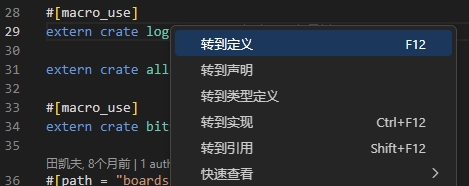

# 探索 `cargo` 的缓存

[部分往届内核及运行指引](./before.md) 提到了 `cargo` 的离线编译与缓存。Rust 库具体会被 `cargo` 缓存到哪里呢？

打开我们前两个实验的 `rCore-Tutorial` 仓库，在 `os/src/main.rs` 找到 `extern crate log` 一行。绝大部分 IDE 都带有“跳转到定义”的功能（或者也可以直接在 `~/.cargo` 下搜索），例如 `vscode` 的：



我们可以通过跳转或者搜索，去看 `log` 库的代码：

**思考题1.1**：这些代码具体在 `~/.cargo` 下的哪个文件夹？

### 临时修改依赖库

找到第 1352 行左右的 `set_logger` 函数，我们在 `rCore-Tutorial` 初始化时会调用它。把第一行加个分号 `;` ，然后加个 `panic`，也即改成：

```rust
pub fn set_logger(logger: &'static dyn Log) -> Result<(), SetLoggerError> {
    set_logger_inner(|| logger);
    panic!("123")
}
```

然后先 `make clean` 再 `make run`，可以看到我们的 `panic` 真的生效了。这意味着如果在 debug 时怀疑依赖库的输出，是可以直接在依赖库里修改的！比如你可以加一些 `panic!` `assert!` 这样的判断，或者修改代码的运行逻辑。一般来说你无法在依赖库中 `println!` 但可以通过向 `panic!` 传递字符串来实现近似的输出效果。

无论如何，修改依赖库的代码是一件危险的事情。当需要恢复这些修改，可以把代码改回去，**也可以直接删掉整个 `log` 仓库**，因为这些仓库只是“缓存”，下次编译时 `cargo` 还会自动从网络拉取的。当然，别忘了先 `make clean` 再 `make run`。

**思考题1.2**：如果忘记 `make clean` 会发生什么？

### 如果你真的需要修改依赖库

一般来说，我们只会通过这种方式检查依赖库运行的逻辑，以辅助寻找内核中的 bug。如果它本身存在 bug 或者缺少你需要的功能，最好的办法是克隆它的 git 项目，修改后向原作者提出 `pull request`。或者至少也需要像上一节提到的离线编译那样，在内核项目下开一个类似 `dependencies/` 的目录，把对这个模块的依赖变成本地依赖。