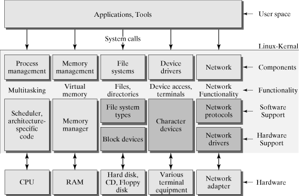

# 操作系统与模块划分

在具体介绍如何编写一个独立的内核模块前，我们先来看看什么是模块化操作系统。

模块化程序设计技术是20世纪60年代出现的一种结构化程序设计技术。该技术是基于“分解”和“模块化”原则来控制大型软件的复杂度。模块化结构的操作系统基于程序模块化开发的思想，按照功能划分了多个具有一定独立性和大小的模块，如进程管理模块、存储器管理模块、`I/O` 设备管理模块等，并仔细地规定好各模块间的接口，使各模块之间能通过该接口实现交互。然后，再进一步将各模块细分为若干个具有一定功能的子模块之间的接口。若子模块较大时，可再进一步将它细分，此构成的操作系统就是具有模块化结构的操作系统。

Linux系统本身就是一个具有模块化的操作系统，但这个模块化的系统在不断发展的过程中丢失了一些模块化特征。在谈论模块化时，我们主要关注两个特征

1. 内聚性：指模块内部各部分间联系的紧密程度。模块内联系越紧密，模块的独立性越好
2. 耦合性：指模块间相互联系和相互影响的程度。模块间联系越少，模块的独立性越好

理论上来说，我们希望一个模块应该同时具备上述两个特征。但Linux内核中的模块即使经过了很细致的划分，仍然会出现很多耦合。比如伙伴分配器（`buddy_system_allocator`）在 `rCore-Tutorial` 内核被用来管理内核堆的分配。而在Linux内核中，这个模块不仅仅负责分配物理页，还和其它的模块有着非常复杂的交互，很多模块会依赖伙伴分配器的私有数据做出决策。虽然这样的模块间互动对性能提升有帮助，但是在我们的内核实现中，应该尽量避免这种情况的发生，我们希望一个模块可以只做好它本身的事情并且避免侵入式的数据访问。这种情况之所以在Linux内核中普遍存在，与内核使用的编程语言不无关系。C语言没有 `Rust` 或者 `Python` 这样方便的包管理器和平台，因此对模块的拆分和复用都比较困难。

模块的划分一直是模块化系统的难题，需要提前规划和规范，才能减少后续开发时接口不一致的情况。在参加比赛的前期，可以先搭建好内核框架，把内核功能分配到不同的 `Crate` 中，之后再对已有的模块进行筛选，完善它们的功能和接口，形成最终的模块。`rCore-Tutorial` 中的模块 `easy-fs` 就是一个不错的例子，不过如果要以 `rCore-Tutorial` 为基础参赛的话，需要用 `FAT32` 格式的文件系统把它替换掉。

## 从内核中寻找可以独立的模块

当一个模块的功能与内核的功能过于耦合时，这个模块就适合作为独立模块放在内核之外。不过，我们可以对这个模块的内部进一步探索，寻找其中相对独立的部分。对于那些不是那么耦合的模块，可以通过 `Rust` 的 `Trait` 机制来拆分，在后面会给出一个内存文件系统（`RamFs`）的具体例子。

在开始讲解代码实现之前，我们先了解一下往届内核的模块划分情况。这里只给出部分例子，你可以在 [第三章的部分往届内核及运行指引一节](../lab3/before.md) 找到更多的内核。

### [Starry](https://github.com/Azure-stars/Starry)

`Starry` 由 `Arceos` 发展而来，继承了 `Arceos` 的模块化特性。在目录 `crates/` 下包含如下模块：

| 模块名称           | 功能            |
| -------------- | ------------- |
| allocator      | 物理页分配器/内存块分配器 |
| axfs_vfs       | `VFS` `Trait` 定义 |
| axfs_ramfs     | `RamFs` 实现       |
| driver_display | 图形设备驱动        |
| page-table     | 页表实现          |
| scheduler      | 调度算法实现        |
| ....           | ......        |

其中有很多实用的功能模块，且支持 `x86_64` `arm64` `riscv64` 三种架构，在实现自己的内核时可以直接使用这里的模块。如果后续我们要编写自己的独立模块，这些模块也是可学习范例。而 `modules/` 目录下的模块有许多相互之间的依赖，不适合直接引用。

### [ByteOS](https://github.com/yfblock/ByteOS)

`ByteOS` 的结构也类似 `Arceos` ，包含三个目录 `crates` `modules` `drivers` 存放内核之外的模块：

| 模块名称      | 功能              |
| --------- |:--------------- |
| backtrace | 打印内核调用栈(基于fp)   |
| cv1811-sd | `cv1811` 开发板的SD卡驱动 |
| vfscore   | `VFS` `Trait` 定义   |
| timestamp | `DateTime` 结构定义    |

在 `modules` 目录下，也有少数模块可以被直接使用，但更多的模块会直接依赖一个 `ByteOS` 自己的 `arch` 模块 `arch` 模块涵盖了很多功能，因此，如果我们想引用这些模块，要么需要直接使用复杂的 `arch` 模块，要么需要手动修改代码并删除模块中对 `arch` 的依赖，把它们变成独立的模块。

### [Alien](https://github.com/Godones/Alien)

`Alien` 在实现时将部分内核模块移出了内核，形成了独立模块，你可以在它的项目中找到[模块列表及说明](https://github.com/kern-crates/docs/blob/main/docs/alien.md)。其中主要包含以下模块：

| 模块名称              | 功能                 |
| ----------------- | ------------------ |
| syscall-table     | 统一的系统调用            |
| PLIC              | `RISC-V` 的中断控制器        |
| kernel-sync       | 内核锁的实现，兼容 `lock-api` |
| pager             | 物理页分配器             |
| rslab             | 内存分配器              |
| vfscore           | `VFS` `Trait` 定义      |
| devfs/ramfs/fatfs | 根据 `vfscore` 实现的具体文件系统 |
| visionfive2-sd    | VF2开发板的SD卡驱动       |
| .....             |                    |

在Alien中，很多模块是可以直接被复用的，不需要使用者额外再依赖别的模块。

### [Umi](https://github.com/js2xxx/umi/)

`Umi`是一个全异步的内核，与其它内核不同，这个内核中的许多模块是异步的。对于想要编写异步内核的同学来说，这些模块很值得参考，但是对于非异步内核，这些模块可能较难复用。

| 模块名称       | 功能           |
| ---------- | ------------ |
| paging     | 页表抽象         |
| rand-riscv | 随机数生成器       |
| hart-id    | 获取当前的`hart id` |

| 模块名称    | 功能            |
| ------- | ------------- |
| afat32  | 异步 `FAT32` 文件系统       |
| art     | Rust的 `async` 运行时 |
| co-trap | 内核陷入陷出        |
| kalloc  | 内存分配          |
| ksync   | 异步同步原语        |
| ....    |               |

与`ByteOS`类似， `Umi`中的大多数模块是紧耦合的，模块相互之间的依赖很多。不过其中的一部分依赖是异步 `async` 标记导致的，如果去掉异步特性，就可以把很多模块变成独立模块。

## 可选实现：抽象出一个独立的模块

如果对上面这些模块感兴趣，还可以进一步阅读这些内核的代码实现和文档（不只是模块本身的文档，不少比赛参赛内核会提供开发过程的文档），进一步了解他们在进行模块化时考虑了什么因素，又是如何处理模块之间的依赖的。

你可以这里面与内核联系较深、不够独立的模块分离出来，变成能在各个内核间通用的模块，以此作为本实验的作业。

在下一节，我们会对独立模块的设计给出具体的要求和建议。